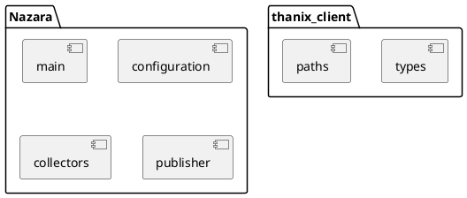
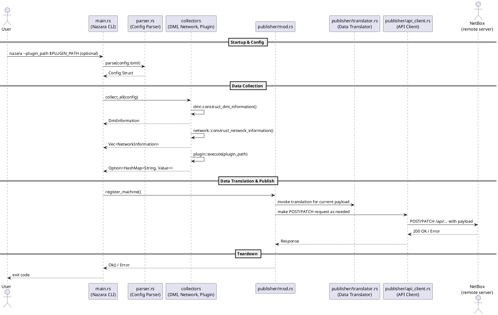

# Nazara Architecture Guide

## Introduction

This document explains the structure and architecture chosen for Nazara and gives an overview over its components.

Nazara is a tool for automating the registration and update process of physical machines and virtual machines in
[NetBox](https://netboxlabs.com/docs/netbox/), a open-source IPAM tool.

Ease of use is important in this regard, users should be able to pick Nazara up quickly, and be able to comfortably
integrate it into their daily workflow. With automation if they wish.

Nazara, very roughly, has 3 main functions: Collection, Translation and Publishing. (Excluding the configuration
module here)

The **Collection** module is soley responsible for collecting information about the host system the user wants to register.
This includes things like the device's network interfaces, IP addresses and other hardware information. All collected from
the DMI tables.

The **Translator** module handles data process and translates all information that the collector has collected into appropriate
API payload objects. These objects are defined by the NetBox API and brought to Nazara via the [`thanix_client`](https://codeberg.org/nazara-project/thanix_client)
crate. This crate is generated automatically by us and serves as the API client library used for making API requests to NetBox.

The **Publisher** module is the most "superior" module hierarchially. It handles the whole registration process and decided when 
which translation needs to be made and which API call to be sent.

## Goals

*Now, what problem does Nazara solve?*

Some system administrators have a overwhelming number of machines. Or maybe they get sent upgrades to prototype hardware multiple times
a year. When dealing with this large amount of machine turnover, Nazara provides an easy to use tool to eliminate the tedious task
of manually registering or updating device or VM information.

*What are the essential features and goals for Nazara?*

- Ease of use
- Registration of machines and VMs and their associated components
- Automatization of custom field collection

## Non-Goals

Nazara is simply a tool to register/update machines and VMs in NetBox. Beyond that it is currently not planned
to have any other kind of managing role alongside NetBox or other IPAM tools.

## Design

Nazara - codewise - is supposed to be **highly modular** and respect strict **separation of concerns**.
This means that **one logical unit does only one thing** and **contain all the logic necessary to achieve their goal**.

This starts with modules: The `Collector`, `Configuration`, `Translator` and `Publisher` modules all only have **one 
responsibility**. 
We believe that - wherever sensible and possible - each module, each file and each function should have one responsibility.
For a new additional feature we would rather introduce another module that handles that responsibility than break this principle.

In addition to this **all interfaces between modules should be as small as possible**. Preferably one or two functions.
This makes it easier to mentally follow the execution flow and avoids any kind of cross referencing or massive rewrites once
a single module needs to be rewritten.

This philosophy should also extend to Nazara's `Git`-History. You can find more on that in the
[Contributor Guide](../contributors/index.md).

### High-Level-Design

As mentioned before, Nazara is designed with strict separation of concerns in mind.
The following is a very high-level overview of Nazara's four logical parts:

- The Collectors
- The Configuration Package
- The Publisher
- The Main module

It also shows the two modules of our `thanix_client` crate, which we created specifically
for sending API requests to NetBox. More on that later.

The following diagram gives an overview over the program flow once started by a user.
Note that the exact function calls within `translator.rs` and the difference between POST/PATCH
requests has been omitted for simplicity.

In reality, the `publisher` checks if the device has already been registered. The easiest way to do this 
would be to pass the ID the device or VM has in NetBox, however we are capable of searching given several
parameters like serial number or UUID. Though these methods are less reliable.

In any way, the publisher then decides whether a POST or PATCH request shall be made.

