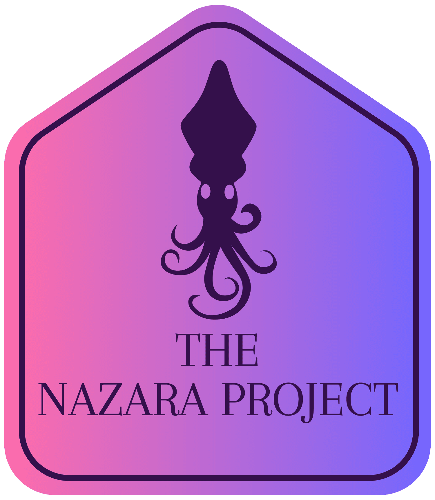

<p align="center">
    
</p>

**Welcome to Nazara's documentation hub!**

Nazara is a Rust tool used to automate the registration and update process of machines and VMs in the
IPAM tool [NetBox](https://netboxlabs.com/docs/netbox/).

```admonish info
Nazara is currently in it's Beta stage. Bugs are bound to happen.
```

```admonish tip
Found a bug or a typo? [Open an issue on GitHub](https://github.com/The-Nazara-Project/Nazara/issues/new/choose)
```

## Compatibility

We strive to make sure to stay compatible with the most recent NetBox version. Here you can see which version
of Nazara is compatible with which version of NetBox (and if we still support it). When major ports to new
versions of NetBox happen - which usually includes breaking changes - the old version of Nazara will be moved
to its own branch and tagged accordingly.

|Nazara Version  |NetBox Version               |Branch           |maintained?|
|----------------|-----------------------------|-----------------|---|
|`v0.1.0_beta.2` |`v4.3.x`, `v4.4.x` and newer |`main`           |yes|
|`v0.1.0_beta.1` |`v4.3.x`                     |`version/beta-1` |no |
|`v0.1.0_alpha.2`|`v3.6.x`                     |`version/alpha-2`|no |

Maintenance work on these older versions is not planned currently.

```admonish warning
Nazara was developed for and on Linux systems. We have no plans to support Windows or Mac in the foreeable future.
If you would like to add support for this, please open a discussion in our GitHub repository.
```

## Distribution Channels

This is an overview of channels through which you can get Nazara.

|Platform/Channel|Version|Offical?|
|-|-|-|
|[`crates.io`](https://crates.io/crates/nazara)|`v0.1.0_beta.2`|yes|
|openSUSE Tumbleweed|--coming soon--|--coming soon--|

For information about who maintains a package you are looking for, try
looking into the `PACKAGERS.md` file in our project's root directory.
